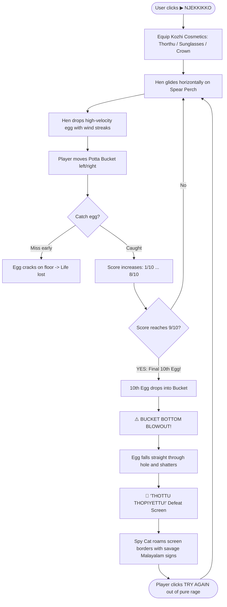

# Ippa Kittum (ഇപ്പ കിട്ടും!) 🎯

## Basic Details
### Team Name: FaFa

### Team Members
- Team Lead: Fayiza Mariyam - KMEA Engineering College
- Member 2: Mohammed Fahim ES - KMEA Engineering College

### Project Description
*Ippa Kittum* is a hyper-polished, golden-hour arcade web game disguised as a friendly egg-catching challenge. Players are lured in with responsive bucket controls, dynamic wind-streak physics, an aerodynamic hen gliding on a spear perch, customizable troll cosmetics, and real-time synthesized audio. However, the game is mathematically unwinnable: as soon as the player catches the 10th egg (reaching 9/10), the egg falls straight through a pre-broken hole in the bucket, shattering on the ground and crowning them with **"THOTTU THOPIYETTU! 🤡"**.

### The Problem (that doesn't exist)
Modern humans suffer from dangerously inflated self-confidence, low daily frustration quotients, and an unwarranted belief that hard work and precision always yield success. Furthermore, there was an alarming, catastrophic shortage of digital Malayali poultry engineered specifically to instill existential dread, build false hope, and shatter dreams at the exact finish line.

### The Solution (that nobody asked for)
We built a state-of-the-art, zero-dependency browser game that maximizes player emotional damage through:
- **Aerodynamic Spear Perch & Wind Mechanics**: A Kozhi gliding horizontally on a razor-sharp spear, dropping high-velocity eggs accompanied by directional speed streaks and wind particles.
- **The "Potta" Bucket Betrayal**: An artisanal wooden bucket held together by hazard caution tape, featuring a jagged blowout hole on the bottom left designed to eject the final egg.
- **Surveillance Spy Cat**: An omnipresent feline roaming all four edges of the screen holding savage, handcrafted Malayalam protest signs (*"Nirthi podey"*, *"Ini oru round koodi tholkk"*).
- **Authentic Manglish Audio & Commentary**: 100% procedurally synthesized Web Audio sound effects (clucks, cracks, clangs, whooshes, boings) paired with real-time roasting popups.

## Technical Details
### Technologies/Components Used
For Software:
- **Languages used**: HTML5, CSS3, JavaScript (ES6+)
- **Frameworks used**: None (Pure Vanilla Web Architecture)
- **Libraries used**: Native Browser Web Audio API (real-time procedural sound synthesis), Google Fonts (`Outfit`, `Fredoka`)
- **Tools used**: Visual Studio Code, Git, GitHub, Browser Developer Tools

For Hardware:
- **Main components**: Not Applicable (Pure Web Software Project)
- **Specifications**: Runs on any device with a modern web browser and a functioning screen
- **Tools required**: 1x Mouse, Trackpad, or Touchscreen; 1x Set of working ears; 1x Unbreakable emotional resilience

### Implementation
For Software:
# Installation
```bash
# Clone the repository
git clone https://github.com/faheec/useless_project_temp.git

# Navigate into the project folder
cd useless_project_temp
```

# Run
```bash
# Open index.html in any modern browser (Chrome, Edge, Firefox, Safari)
# On Windows:
start index.html

# Or run via Python local server (optional):
python -m http.server 8000
```

### Project Documentation
For Software:

# Screenshots (Add at least 3)

*Figure 1: The Golden Hour Arcade Start Screen with character customization (Thorthu, Sunglasses, Gold Chain, Cowboy Hat, Alien Antennas, Royal Crown).*


*Figure 2: High-speed gameplay showing the aerodynamic spear perch, falling egg physics, wind particles, and the Potta Bucket with hazard tape.*


*Figure 3: The inevitable 9/10 betrayal: the egg falls through the bucket blowout hole, triggering the 'THOTTU THOPIYETTU! 🤡' screen and the roving spy cat.*

# Diagrams

*Figure 4: Complete state machine & emotional journey of an Ippa Kittum player.*

For Hardware:

# Schematic & Circuit
*Not Applicable — This is a pure web software project.*  
*(The only electrical circuits involved are the microchips inside your CPU sweating while computing unwinnable physics).*

# Build Photos
*Not Applicable — Pure digital artifact with 0 physical hardware components.*  
*(All builds occur instantaneously in the browser DOM).*

### Project Demo
# Video
[Demo Video Link](https://github.com/faheec/useless_project_temp) *(Replace with your YouTube/Drive demo video link once recorded)*  
*Demonstration of the deceptive start screen, runaway button prank, spear perch wind animations, cosmetic switching, procedural Web Audio effects, and the ultimate 9/10 bucket-hole betrayal.*

# Additional Demos
- **Live Local Preview**: Open `index.html` directly in any web browser.
- **Source Code Repository**: [https://github.com/faheec/useless_project_temp](https://github.com/faheec/useless_project_temp)

## Team Contributions
- **Fayiza Mariyam**:
  - Conceptualization & comedic narrative direction.
  - UI/UX layout, Twilight Glassmorphism design system, and mobile responsive adaptations.
  - Manglish dialogue writing, spy cat roast signs, and character cosmetic styling (Thorthu, Cowboy Hat, Alien Antennas, Royal Crown).
- **Mohammed Fahim ES**:
  - Core game engine architecture, frame-rate independent physics loop, and collision detection.
  - Aerodynamic spear perch SVG modeling, high-speed egg trajectory, and dynamic wind streak particle animations.
  - Procedural Web Audio API sound synthesis engine (generating clucks, cracks, clangs, pecks, and whooshes with zero external assets).
  - Broken "Potta" bucket blowout hole logic, full-screen roaming cat spy state machine, and Git version control.

---
Made with ❤️ at TinkerHub Useless Projects 


